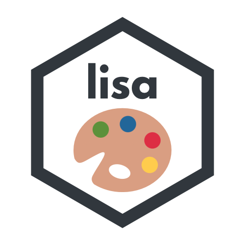

<!-- README.md is generated from README.Rmd. Please edit that file -->

```{r, include = FALSE}
knitr::opts_chunk$set(
  collapse = TRUE,
  comment = "#>",
  fig.path = "man/figures/README-",
  out.width = "100%",
  dpi = 300
)
```
# lisa 

<!-- badges: start -->
[](https://travis-ci.org/tyluRp/lisa)
[](https://ci.appveyor.com/project/tyluRp/lisa)
[](https://cran.r-project.org/package=lisa)
[](https://cran.r-project.org/package=lisa)
[](https://codecov.io/gh/tyluRp/lisa?branch=master)
<!-- badges: end -->

This is a color palette R package that contains 128 palettes from [**Color Lisa**](http://colorlisa.com/).

```{r waffle, echo=FALSE, fig.height=2}
library(lisa)

parts <- data.frame(
  names = names(lisa),
  vals = 1
)

waffle::waffle(parts, rows = 5, colors = purrr::flatten_chr(lisa)) +
  ggplot2::theme(legend.position = "none")
```

## Installation

Install the released version of `lisa` from CRAN:

```r
install.packages("lisa")
```

Or install the development version from GitHub with:

``` r
# install.packages("devtools")
devtools::install_github("tylurp/lisa")
```

If you aren't an R user, you might be interested in [palettes.yml](inst/extdata/palettes.yml) which contains all palettes in [YAML](https://en.wikipedia.org/wiki/YAML) format.

## Palettes

Here's a sample of the available palettes:

```{r, include=FALSE}
set.seed(4378)
```

```{r example1, results='hide'}
library(lisa)

par(mfrow = c(6, 3))
lapply(sample(lisa, 18), plot)
```

You can also call and/or modify palettes using `lisa_palette`:

```{r example2, fig.height=1, results='hide'}
x <- lisa_palette("JackBush_1", 1000, "continuous")
y <- lisa_palette("PabloPicasso", 2, "discrete")
z <- lisa_palette("KatsushikaHokusai", 1000, "continuous")
lapply(list(x, y, z), plot)
```

All palettes have 3 attributes associated with them:

```{r}
# shows the class, artist name, and name of work
attributes(lisa$VincentvanGogh)

# attributes do not print by default
lisa$VincentvanGogh

# there is also a data.frame with palette descriptions
head(artwork, 5)
```

Example `ggplot2` usage:

```{r ggplot2-example, fig.height=4}
library(ggplot2)

ggplot(mtcars, aes(mpg, disp)) + 
  geom_point(aes(col = factor(gear)), size = 3) + 
  scale_color_manual(values = lisa$`Jean-MichelBasquiat`) + 
  theme_bw()
```


## Acknowledgements

* [**Color Lisa**](http://colorlisa.com/) for the color palettes
* [`wesanderson`](https://github.com/karthik/wesanderson) for source code that powers most things in this repository
