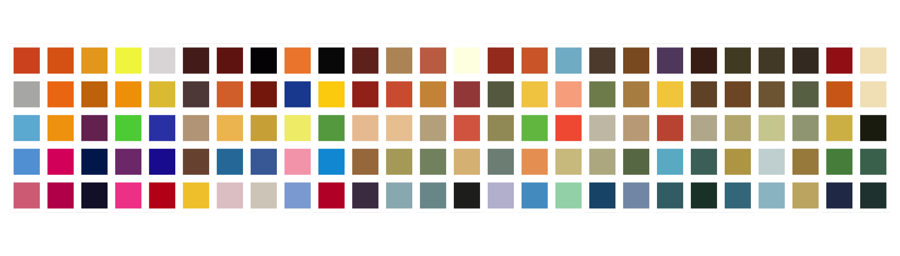

<!-- README.md is generated from README.Rmd. Please edit that file -->

# lisa

<!-- badges: start -->

[](https://travis-ci.org/tyluRp/lisa)
[](https://ci.appveyor.com/project/tyluRp/lisa)
[](https://cran.r-project.org/package=lisa)
[](https://cran.r-project.org/package=lisa)
<!-- badges: end -->

This is a color palette R package that contains 128 palettes from
[**Color Lisa**](http://colorlisa.com/).



## Installation

Install the released version of `lisa` from CRAN:

``` r
install.packages("lisa")
```

Or install the development version from GitHub with:

``` r
# install.packages("devtools")
devtools::install_github("tylurp/lisa")
```

## Palettes

Here’s a sample of the available palettes:

``` r
library(lisa)

par(mfrow = c(6, 3))
lapply(sample(lisa, 18), plot)
```


You can also call and/or modify palettes using `lisa_palette`:

``` r
x <- lisa_palette("JackBush_1", 1000, "continuous")
y <- lisa_palette("PabloPicasso", 2, "discrete")
z <- lisa_palette("KatsushikaHokusai", 1000, "continuous")
lapply(list(x, y, z), plot)
```


Finally, all palettes have 3 attributes associated with them:

``` r
# shows the class, artist name, and name of work
attributes(lisa$VincentvanGogh)
#> $class
#> [1] "lisa_palette" "character"   
#> 
#> $name
#> [1] "VincentvanGogh"
#> 
#> $work
#> [1] "The Starry Night"

# there is also a data.frame (excludes class)
head(artwork, 5)
#>              artist          palette                              work
#> 1      Josef Albers      JosefAlbers     Adobe (Variant): Luminous Day
#> 2      Josef Albers    JosefAlbers_1 Homage to the Square (La Tehuana)
#> 3 Gretchen Albrecht GretchenAlbrecht                      Golden Cloud
#> 4       Billy Apple       BillyApple                           Rainbow
#> 5       Per Arnoldi       PerArnoldi                              Spar
```

## Acknowledgements

  - [**Color Lisa**](http://colorlisa.com/) for the color palettes
  - The [`wesanderson`](https://github.com/karthik/wesanderson) package
    for source code that powers pretty much everything in this
    repository.
