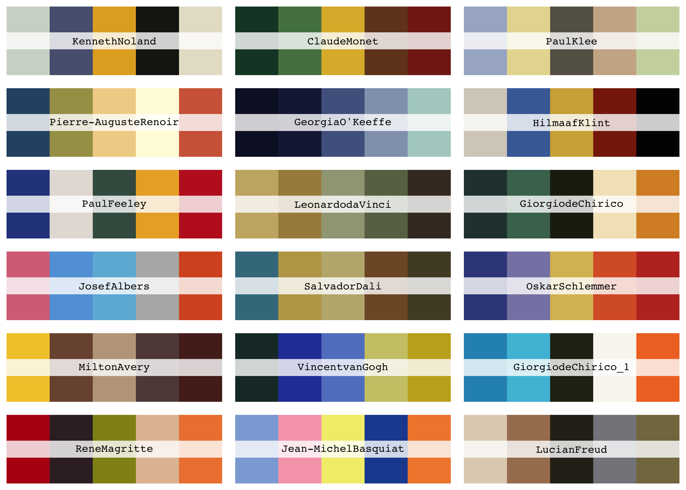

<!-- README.md is generated from README.Rmd. Please edit that file -->

# lisa

<!-- badges: start -->

[](https://travis-ci.org/tyluRp/lisa)
[](https://ci.appveyor.com/project/tyluRp/lisa)
<!-- badges: end -->

This is a color palette R package that contains 128 palettes from
[**colorlisa**](http://colorlisa.com/).

## Installation

You can install `lisa` from GitHub with `devtools`:

``` r
devtools::install_github("tylurp/lisa")
```

## Palettes

Here’s a sample of the available palettes:

``` r
library(lisa)

par(mfrow = c(6, 3))
lapply(sample(lisa, 18), plot)
```



You can also call and/or modify palettes using `lisa_palette`:

``` r
x <- lisa_palette("JackBush_1", n = 100, "continuous")
plot(x)
```


## Acknowledgements

  - [**colorlisa**](http://colorlisa.com/) for the color palettes
  - The [`wesanderson`](https://github.com/karthik/wesanderson) package
    for source code that powers pretty much everything in this
    repository.
