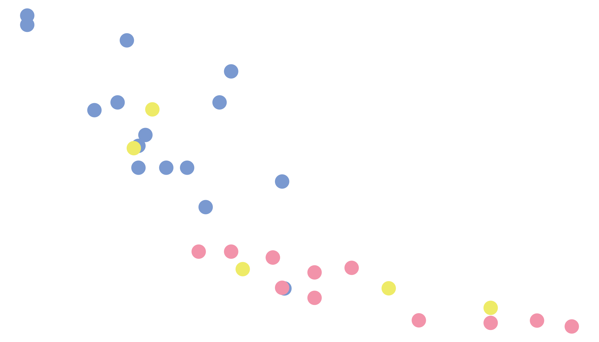

<!-- README.md is generated from README.Rmd. Please edit that file -->

lisa 
===============================================================

<!-- badges: start -->

<!-- badges: end -->

This is a color palette R package that contains 128 palettes from
[**Color Lisa**](http://colorlisa.com/).

Installation
------------

Install the released version of `lisa` from CRAN:

    install.packages("lisa")

Or install the development version from GitHub with:

    # install.packages("devtools")
    devtools::install_github("tylurp/lisa")

If you aren’t an R user, you might be interested in
[palettes.yml](inst/extdata/palettes.yml) which contains all palettes in
[YAML](https://en.wikipedia.org/wiki/YAML) format.

Palettes
--------

Here’s a sample of the available palettes:

    library(lisa)

    par(mfrow = c(6, 3))
    lapply(sample(lisa, 18), plot)

You can also call and/or modify palettes using `lisa_palette`:

    x <- lisa_palette("JackBush_1", 1000, "continuous")
    y <- lisa_palette("PabloPicasso", 2, "discrete")
    z <- lisa_palette("KatsushikaHokusai", 1000, "continuous")
    lapply(list(x, y, z), plot)

All palettes have 3 attributes associated with them, you can access them
with the `lisa` list:

    lisa$VincentvanGogh
    #> * Work: The Starry Night 
    #> * Author: Vincent van Gogh 
    #> * Colors: #1a3431 #2b41a7 #6283c8 #ccc776 #c7ad24

There is also a table with more information of all available palettes:

    artwork
    #> # A tibble: 128 x 5
    #>    author     work           palette     colors         url                     
    #>    <chr>      <chr>          <chr>       <chr>          <chr>                   
    #>  1 Josef Alb… Adobe (Varian… JosefAlbers #D77186 #61A2… http://www.wikiart.org/…
    #>  2 Josef Alb… Homage to the… JosefAlber… #C00559 #DE1F… http://www.wikiart.org/…
    #>  3 Gretchen … Golden Cloud   GretchenAl… #171635 #0022… https://www.google.com/…
    #>  4 Billy App… Rainbow        BillyApple  #F24D98 #813B… http://www.wikiart.org/…
    #>  5 Per Arnol… Spar           PerArnoldi  #C2151B #2021… http://www.moma.org/col…
    #>  6 Milton Av… Bicycle Rider… MiltonAvery #F3C937 #7B53… http://www.wikiart.org/…
    #>  7 Milton Av… Cello Player   MiltonAver… #E2CACD #2E7C… http://www.wikiart.org/…
    #>  8 Hilma af … The Swan       HilmaafKli… #D6CFC4 #466C… https://artblart.files.…
    #>  9 Jean-Mich… Untitled (Bla… Jean-Miche… #8CABD9 #F6A7… http://www.widewalls.ch…
    #> 10 Jean-Mich… DUSTHEADS      Jean-Miche… #C11432 #009A… http://www.christies.co…
    #> # … with 118 more rows

Example `ggplot2` usage:

    library(ggplot2)

    ggplot(mtcars, aes(mpg, disp)) + 
      geom_point(aes(col = factor(gear)), size = 5, show.legend = FALSE) + 
      scale_color_manual(values = lisa$`Jean-MichelBasquiat`) + 
      theme_void()

Acknowledgements
----------------

-   [**Color Lisa**](http://colorlisa.com/) for the color palettes
-   [`wesanderson`](https://github.com/karthik/wesanderson) for source
    code that powers most things in this repository
